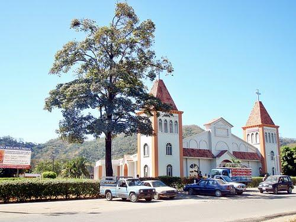

# **Percepción del tiempo en espacios distintos**

**Hipótesis:** En el contexto rural el tiempo pasa más despacio que en la urbanidad por el movimiento de los cuerpos y dinámicas que componen dichos espacios según el tiempo que se vive.

__Pregunta:__ ¿Influye el movimiento de los cuerpos y dinámicas en el contexto rural y urbano sobre la percepción del tiempo?

## **Discusión de la hipótesis:**

De forma personal se puede percibir que mientras más se da un alejamiento del centro de poder hacia las periferias del país existe una ralentización del tiempo en el espacio, en un primer lugar la ciudad, específicamente la de San José, se entiende como un espacio altamente dinámico, de paso y con mucho movimiento, mientras zonas como Jicaral o Lepanto de Puntarenas se pueden percibir como lentas, donde el día tiene una duración extraordinariamente larga con pocos focos de concentración social. Si se utiliza el mismo reloj en ambas zonas se puede verificar que el tiempo transcurre exactamente igual, son las 7am o 3pm en ambos lugares al mismo tiempo, esto sin incluir la fuerza gravitacional que haría una modificación al tiempo por un cuerpo masivo.
Empleando los medios de transporte públicos como autobús, ferry y autos también se puede ver que existe un total aproximado de 7 horas de viaje entre un punto y otro tomando en cuenta las horas de salida y viaje de estos medios de transporte anteriormente descritos para hacerlo.

_Jicaral, Puntarenas de Costa Rica_, imagen tomada de [Ver País.](https://www.verpais.com/costa+rica/puntarenas/jicaral/foto/2895/)

_San José, San José de Costa Rica_, imagen tomada de [Instituto Unesco.](https://www2.uil.unesco.org/es/aprendizaje-lo-largo-vida/ciudades-aprendizaje/ciudades-del-aprendizaje-costa-rica-san-jose-se-red)

Para poder trabajar con los conceptos de tiempo y espacio se emplea parte de la [_teoría de la relatividad_](https://es.wikipedia.org/wiki/Teor%C3%ADa_de_la_relatividad) de Albert Einstein, más específicamente el concepto de [_dilatación del tiempo_](https://es.wikipedia.org/wiki/Dilataci%C3%B3n_del_tiempo#:~:text=De%20acuerdo%20con%20la%20teor%C3%ADa,relaci%C3%B3n%20con%20un%20campo%20gravitacional.) siendo así que el tiempo será percibido según los observadores o cuerpos de acuerdo con el estado de movimiento que adquieran o en la ausencia de este, por tanto se puede decir que el tiempo es capaz de acortarse o extenderse si existe más o menos velocidad aplicada sobre la distancia entre un punto inicial y otro final, así como el efecto de la fuerza de algún campo gravitatorio que modifique el tiempo siendo este relativo pero no entramos en detalle con la teoría general, sino con la especial.

Podría plantearse que debido al menor movimiento propio de ciertos contextos rurales por su naturaleza el tiempo se puede percibir, y podría ser debido a la gravedad, como lento, así como las dinámicas que las personas realizan porque ordenan sus vivencias con el mismo.
A diferencia del espacio urbano donde existen factores que tienen mucho movimiento como:

1. El tránsito.
2. El comercio.
3. La economía.
4. Los centros educativos.
5. Bienes y servicios más cercanos.

Que dan la sensación de que el tiempo no alcanza o que va más rápido.

Y es que es acá donde también se encuentra una paradoja, si nos aproximamos a la velocidad de la luz o se va rápido en la ciudad: _¿por qué no parece que todo alrededor va lento sino igual de rápido?._
En este mismo contexto, personalmente pienso, que es porque todo va a un nivel de velocidad parecido por tanto no habría una diferencia notable y por eso sí es notable en otras zonas geográficas con contexto propios.

### **Bibliografía:**

- [Dilatación del tiempo](https://es.wikipedia.org/wiki/Dilataci%C3%B3n_del_tiempo#:~:text=De%20acuerdo%20con%20la%20teor%C3%ADa,relaci%C3%B3n%20con%20un%20campo%20gravitacional.)
- [Teoría de la relatividad](https://es.wikipedia.org/wiki/Teor%C3%ADa_de_la_relatividad)
- [La Dilatación del Tiempo|FU2020](https://youtu.be/V8mrEJsx7cE)
- [Qué es la teoría de la relatividad de Einstein y por qué fue tan revolucionaria](https://youtu.be/oFbgfkh4cj8)
